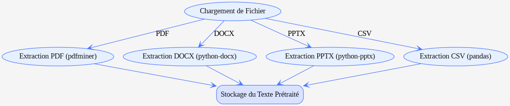

# Projet d'Intelligence Artificielle et d'Inclusion Sociolinguistique

## Description

Ce projet a été conçu dans le cadre du Hackathon « Intelligence Artificielle et Inclusion Sociolinguistique » organisé par l’Université Cheikh Anta Diop de Dakar. Il s’agit d’une application intelligente qui utilise des technologies d’intelligence artificielle (IA) pour faciliter l’accès à l’information en langues locales africaines. 

Grâce à des modèles de traitement du langage naturel (NLP), cette application permet de :
- Résumer des documents volumineux
- Extraire et comprendre le contexte de documents divers
- Répondre à des questions posées en utilisant un système de Recherche Augmentée par Récupération (RAG)

### Objectif

Le projet vise à réduire les barrières linguistiques rencontrées par les communautés africaines en leur offrant des outils numériques multilingues (wolof, français, anglais). Ce système inclusif permet d’accéder à l’information de manière simplifiée et accessible, renforçant ainsi l’inclusion sociolinguistique en Afrique.

## Fonctionnalités

1. **Extraction de Texte Multi-format** : 
   - Prise en charge de documents PDF, DOCX, PPTX et CSV.
   - Extraction automatique du texte contenu dans chaque document pour le traitement.

2. **Résumé Automatique** :
   - Génération de résumés concis pour des documents volumineux en utilisant le modèle BART.
   - Support pour les langues locales afin de garantir une compréhension optimale du contenu.

3. **Recherche Augmentée par Récupération (RAG)** :
   - Répond aux questions en identifiant le contexte pertinent dans les documents disponibles.
   - Génération de réponses synthétiques et contextualisées en fonction des requêtes de l’utilisateur.

4. **Interface Utilisateur Interactive** :
   - Application Web interactive développée avec Streamlit.
   - Interface simple pour télécharger des documents, poser des questions et visualiser des réponses et résumés.

## Architecture du Projet

L’architecture de l’application est organisée autour des modules suivants :
- **Téléchargement de Fichiers** : Permet de télécharger différents formats de fichiers pour l'analyse.
- **Extraction de Texte** : Utilise des bibliothèques spécialisées pour extraire le texte des documents.
- **Recherche et Génération de Résumé (Système RAG)** : Génère des résumés et des réponses basés sur les documents fournis, en utilisant un modèle NLP.
- **Interface Utilisateur** : Une interface développée avec Streamlit, facilitant l’interaction avec les utilisateurs.

## Prérequis

Assurez-vous d’avoir Python 3.8 ou une version ultérieure installée. Vous pouvez vérifier la version de Python avec :

```bash
python --version
```

## Installation

1. **Cloner le dépôt** :

   ```bash
   git clone https://github.com/LordPhenixDeNetra/projet-IA-inclusion-sociolinguistique.git
   cd projet-IA-inclusion-sociolinguistique
   ```

2. **Installer les dépendances** :

   Utilisez le fichier `requirements.txt` pour installer toutes les bibliothèques nécessaires.

   ```bash
   pip install -r requirements.txt
   ```

<!-- 3. **Installer Graphviz (optionnel)** :
   Si vous souhaitez générer des diagrammes, vous devrez installer Graphviz. Pour Windows, téléchargez-le depuis [le site de Graphviz](https://graphviz.gitlab.io/download/), et pour Linux ou MacOS, exécutez :

   ```bash
   sudo apt-get install graphviz # Pour Linux
   brew install graphviz          # Pour MacOS
   ``` -->

## Utilisation

1. **Lancer l’Application** :
   
   Démarrez le serveur Streamlit depuis le répertoire principal du projet :

   ```bash
   streamlit run app.py
   ```

2. **Fonctionnalités de l’Application** :
   - **Téléchargement de Documents** : Téléchargez un fichier PDF, DOCX, PPTX, ou CSV.
   - **Résumé de Document** : Résumez automatiquement un document téléchargé.
   - **Question Contextuelle (RAG)** : Posez une question pour obtenir une réponse contextuelle, générée à partir du contenu des documents téléchargés.
   - **Affichage** : Les résumés et réponses générés sont affichés directement dans l'interface.

## Dépendances

Les principales bibliothèques utilisées sont :
- **streamlit** : Interface utilisateur interactive.
- **transformers** : Pour utiliser le modèle BART et d’autres modèles NLP.
- **torch** : Backend pour le modèle de deep learning.
- **pdfminer.six, python-docx, python-pptx, pandas** : Pour l'extraction de texte de divers formats de documents.
- **graphviz** : Génération de diagrammes (optionnel).

Pour plus de détails, consultez le fichier `requirements.txt`.

## Exemples de Diagrammes d'Architecture

1. **Architecture Globale** :
   

2. **Extraction et Prétraitement de Texte** :
   

3. **Système RAG** :
   

Ces diagrammes illustrent l’organisation générale de l'application.

## Contribution

Les contributions sont les bienvenues ! Si vous souhaitez apporter des améliorations :
1. Forkez le dépôt.
2. Créez une branche pour votre fonctionnalité (`git checkout -b feature/nouvelle-fonctionnalité`).
3. Effectuez vos modifications et committez-les (`git commit -m 'Ajout d’une nouvelle fonctionnalité'`).
4. Poussez votre branche (`git push origin feature/nouvelle-fonctionnalité`).
5. Ouvrez une pull request.

## Auteurs et Acknowledgements

Ce projet a été développé par [Nom du Chef de Projet] et l’équipe [Nom de l'équipe] dans le cadre du Hackathon « Intelligence Artificielle et Inclusion Sociolinguistique » organisé par l'Université Cheikh Anta Diop de Dakar. Nous remercions tous les organisateurs et participants qui ont contribué à cette initiative inclusive.

## Licence

Ce projet est sous licence MIT - voir le fichier [LICENSE](LICENSE) pour plus de détails.

---

Ce `README.md` fournit toutes les informations essentielles, de la description du projet aux étapes d’installation et d'utilisation, en passant par les informations de contribution..